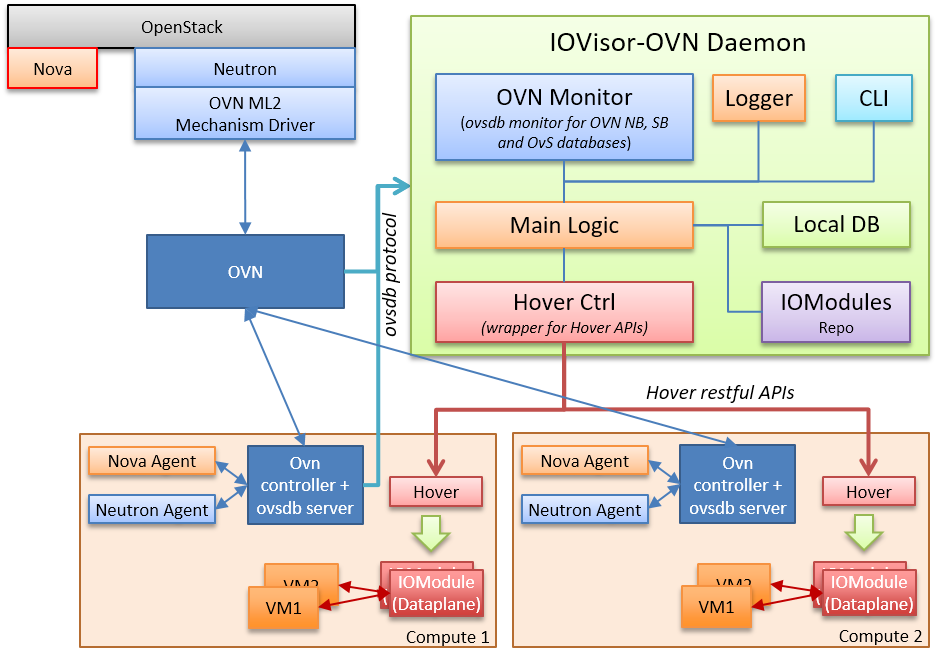

# IOVisor-OVN Architecture

IOVisor-OVN sits on side of the traditional OVN architecture, it intercepts the contents of the different databases and it deploys the required network services using the IOVisor technology, as shown in the Figure below.

## IOVisor-OVN daemon

Daemon is the running daemon that coordinates all other modules.
The daemon is a central system that coordinates the deployment of network services
based on the contents of the OVN databases.

It is made by the following elements.

* **OVN Monitor**. Uses the [libovsdb](https://github.com/socketplane/libovsdb) to monitor all the databases of OVN. (northbound, southbound and the local ovsdb on each compute node)

* **Logger**. It is a simple system that prints info on screen and, optionally, can dump the messages on disk as well.

* **CLI**. The command line interface allows to the user to interact with the system and it is used mainly for troubleshooting and debugging purposes. It provides an easy way to access the actual status of the modules on the hypervisors, and shows the current status of the mapping between OVN network elements and IOModules.

* **Main Logic**. This module implements the logic for deploying the network services across the different compute nodes. It receives a new service network request from OVN, process it and then uses the hover ctrl interface to deploy those services in the different compute nodes.

* **Hover Controller**. The hover controller is a wrapper to send command to the hover instances using a RESTful API.

* **IOModules Repository**. This module is a local Repository that contains the implementation of the different IOModules.
