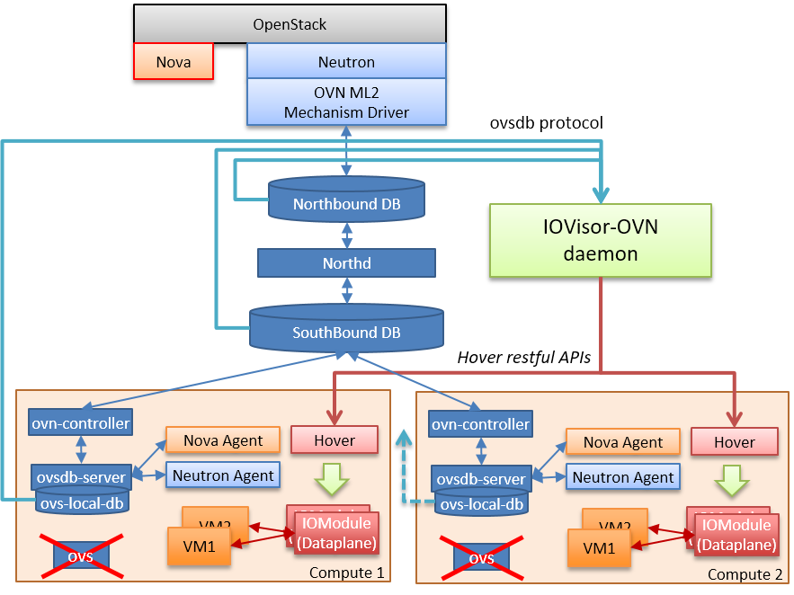

# IOVisor-OVN

IOVisor-OVN extends the current [OVN](https://github.com/openvswitch/ovs/) backend with [IOVisor](https://www.iovisor.org/) technology.
It creates a new data plane that is semantically equivalent to the original OvS-based one, but based on IOVisor, that is exploits the eBPF virtual machine and can be integrated with the eXpress Data Path (XDP) technology for improved performance.

### Why?

 - Complex and efficient virtualized network services are becoming important, which cannot simply implemented using the match/action paradigm implemented by current virtual switches;
 - Complex services cannot be implemented with only OpenFlow-based switches (as OvS), and the current model that mixes different technologies (Linux containers, openFlow switches with the associated controller for the control plane, virtual machines, and more) in order to setup a complex network service is difficult to manage;
 - eBPF is integrated in the Linux kernel and allows to create and deploy (i.e., *inject*) new functions at runtime, without having to upgrade/modify anything in the hosting server.

### How?

 - In this project we replace the current backend of OVN with a new implementation based on IOVisor. This proposal maintains the current OVN architecture that handles orchestration across a datacenter-wise environment, and keeps compatibility with current Cloud Management Systems as OpenStack, Apache Mesos, and other.

## Architecture

IOVisor-OVN sits on side of the traditional OVN architecture, it intercepts the contents of the different databases and it deploys the required network services using the IOVisor technology.

For more details about the architecture please see [architecture details](./ARCHITECTURE.md).

## Install

It is possible to install and deploy a complete OpenStack environment with IOVisor-OVN as network backend.
The process is automatically managed by DevStack scripts.

Please see [installation guide](./INSTALL.md)

## Tutorials

[Tutorials folder](/tutorials) contains a step-by-step guide to try the current IOMdoules available.
* [switch](tutorials/switch): L2 switch
* [router](tutorials/router): L3 router

## Repository Organization:

* **iomodules**: contains eBPF code (i.e., available IOModules).
* **cli**: tool that implements the command line interface of IOVisor-OVN daemon.
* **config**: contains a file with the default configuration parameters used when the daemon start.
* **daemon**: contains the daemon main program entry point.
* **docs**: documentation about this project, presentations, talks.
* **hoverctl**: hover restful api wrapper and utilities.
* **mainlogic**: tool that performs the mapping between the network configuration of OVN and IOModules.
* **ovnmonitor**:  monitors for OVN northbound database, southbound database and local ovs database. Implemented using libovsdb.
* **tutorials**: simple tutorials to try IOModules contained in the repository

## Presentations

  * OVS Fall Conference, San Jose, Nov 2016: [Slides](http://openvswitch.org/support/ovscon2016/7/1245-bertrone.pdf), [Video](https://www.youtube.com/watch?v=9cmR2NuAGz0)

## Licence

The IOVisor-OVN is licensed under the [Apache License, Version 2.0](./LICENSE.txt).
