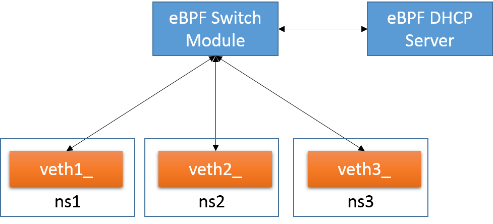

# DHCP Server

In this example a dhcp and a switch modules are deployed, three virtual network interfaces are connected to the switch.

The three virtual network interfaces are in different network namespaces and they do not have an IP address, this is provided then by the dhcp server.
 
<center><a href="../../images/dhcp_tutorial.png"></a></center>

## Preparing the network namespaces

Execute the [setup.sh](./setup.sh) script to create the different network namespace and veth pairs:

```bash
sudo ./setup.sh
```

## Launching hover

Before deploying the router, it is necessary to launch the hover daemon.
Please note to kill other instances of hover previously running.

```bash
export GOPATH=$HOME/go
sudo $GOPATH/bin/hoverd -listen 127.0.0.1:5002
```

## Deploying the DHCP server

The [dhcp.yaml](./dhcp.yaml) file contains the configuration of the dhcp and switch modules and their connections to the external interfaces.

To launch the example please execute:

```bash
export GOPATH=$HOME/go
cd $GOPATH/src/github.com/iovisor/iovisor-ovn/examples/dhcp
$GOPATH/bin/iovisorovnd -file dhcp.yaml -hover http://127.0.0.1:5002
```

## Testing connectivity

Before pinging between the network interfaces, they have to receive an IP address from the DHCP client. 
Execute the following commands to request ip addresses to the server:

```bash
sudo ip netns exec ns1 dhclient
sudo ip netns exec ns1 dhclient
sudo ip netns exec ns3 dhclient
```

Now you are able to test the connectivity pinging between the network interfaces
in the different network spaces, for example:

```bash
# ping ns2 from ns1
sudo ip netns exec ns1 ping 192.168.1.102
# ping ns3 from ns1
sudo ip netns exec ns1 ping 192.168.1.103
# ping ns1 from ns3
sudo ip netns exec ns3 ping 192.168.1.101
```

## Debugging

In order to see the debug output generated by the IOModule we suggest to see the result of the print on the trace_pipe.

```bash
sudo su
cd /sys/kernel/debug/tracing/
cat trace_pipe
```
