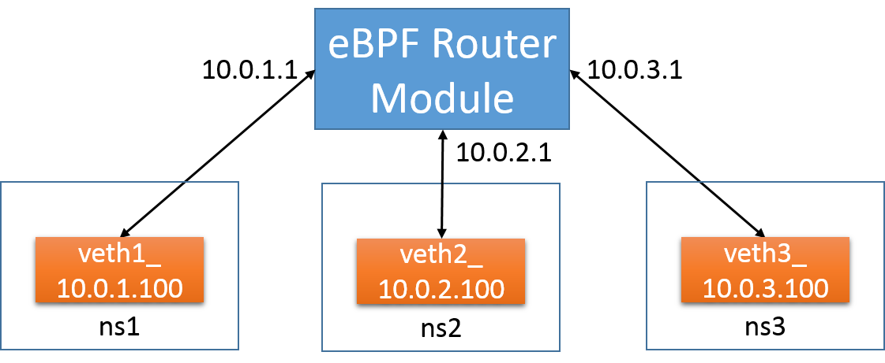

# Router

In this example a router module is deployed and three virtual network interfaces
in different network namespaces are connected to it.
In this case the three virtual network interfaces are configured in different
subnets, then a router mechanishm is needed to allow them to exchange data packets.
Connectivity is tested by pinging between the different namespaces

<center><a href="../../images/router_tutorial.png"></a></center>

## Preparing the network namespaces

The configuration of the network namespaces and the virtual ethernet interfaces
is very similar to the switch case.
The main difference here is that the three network interfaces are in different
subnets and a default route is configured on each namespace.

Execute the [setup.sh](./setup.sh) script:

```bash
sudo ./setup.sh
```

## Launching hover

Before deploying the router, it is necessary to launch the hover daemon.
Please note to kill other instances of hover previously running.

```bash
export GOPATH=$HOME/go
sudo $GOPATH/bin/hoverd -listen 127.0.0.1:5002
```

## Deploying the router

The [router.yaml](./router.yaml) file contains the configuration of the router
and its connections to the external interfaces.

To launch the example please execute:

```bash
export GOPATH=$HOME/go
cd $GOPATH/src/github.com/iovisor/iovisor-ovn/examples/router
$GOPATH/bin/iovisorovnd -file router.yaml -hover http://127.0.0.1:5002
```

## Testing connectivity

Now you are able to test the connectivity pinging between the network interfaces
in the different network spaces, for example:

```bash
# ping ns2 from ns1
sudo ip netns exec ns1 ping 10.0.2.100
# ping ns3 from ns1
sudo ip netns exec ns1 ping 10.0.3.100
# ping ns1 from ns3
sudo ip netns exec ns3 ping 10.0.1.100
```

## Debugging

In order to see the debug output generated by the IOModule we suggest to see the result of the print on the trace_pipe.

```bash
sudo su
cd /sys/kernel/debug/tracing/
cat trace_pipe
```
