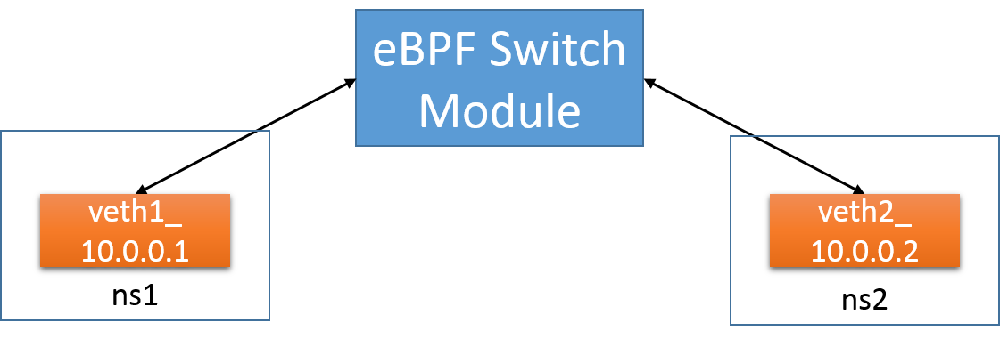

# Switch

In this example a switch module is deployed and two virtual network interfaces
in different network namespaces are connected to it.
Connectivity is tested by pinging between the different namespaces

<center><a href="../../images/switch_tutorial.png"></a></center>

## Preparing the network namespaces

In order to work, it is necessary to create two network namespaces and set two
pairs of veth interfaces.

Execute the [setup.sh](./setup.sh) script:

```bash
sudo ./setup.sh
```

## Launching hover

Before deploying the switch, it is necessary to launch the hover daemon.
Please note to kill other instances of hover previously running.

```bash
export GOPATH=$HOME/go
sudo $GOPATH/bin/hoverd -listen 127.0.0.1:5002
```

## Deploying the switch

The [switch.yaml](./switch.yaml) contains the configuration for this example.

In order to launch it please execute:

```bash
export GOPATH=$HOME/go
cd $GOPATH/src/github.com/iovisor/iovisor-ovn/examples/switch
$GOPATH/bin/iovisorovnd -file switch.yaml -hover http://127.0.0.1:5002
```

## Testing connectivity

Now you are able to test the connectivity pinging between the network interfaces
in the different network spaces

```bash
sudo ip netns exec ns1 ping 10.0.0.2
```

## Debugging

In order to see the debug output generated by the IOModule we suggest to see the result of the print on the trace_pipe.

```bash
sudo su
cd /sys/kernel/debug/tracing/
cat trace_pipe
```
